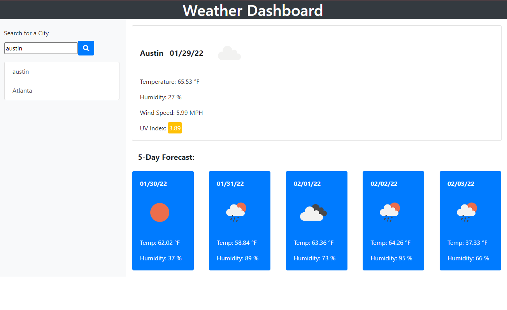

# Weather App

This is a simple application to test my knowledge and skills with Javascript, CSS, and HTML as well as server side APIs by creating an application that generates the weather in any city.  

## Screenshots

## License

[MIT](https://choosealicense.com/licenses/mit/)

## Authors

- [@hamiltondowdy](https://www.github.com/hamiltondowdy)

